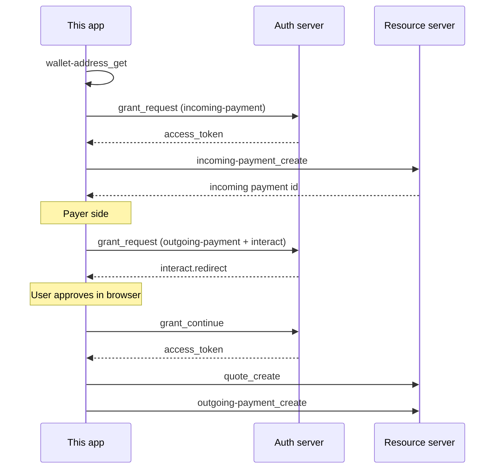

# Open Payments Express App

A lightweight teaching application for exploring the [Open Payments API](https://openpayments.dev/overview/getting-started/). Use it to understand **what to send** when calling each API, and **what comes back** in the response.

The app wraps the official [Node.js Open Payments SDK](https://github.com/interledger/open-payments-node) (`@interledger/open-payments`). SDK calls live in [`services/open-payments.ts`](services/open-payments.ts). The Express server in [`server.ts`](server.ts) exposes them as local REST endpoints. The browser UI in [`index.html`](index.html) renders forms from JSON schemas so you can try each API interactively.

> **New to web development?** Start with the [wiki learning path](wiki/README.md), which introduces HTML, CSS, JavaScript, Git, Node.js, and Express using this repository as the example project.

## What is Open Payments?

[Open Payments](https://openpayments.dev/overview/getting-started/) is an open REST API standard for account servicing entities (banks, digital wallets, mobile money providers). Applications use it to:

- Look up **wallet addresses** (public account identifiers, like email addresses for money)
- Request **grants** (permission to act on someone's account via GNAP)
- Create **incoming payments** (receive money)
- Create **quotes** and **outgoing payments** (send money)

Open Payments does not move funds itself—it issues **payment instructions** to the account provider, which executes settlement separately.

## Learning goals

| Goal                            | Where to learn it                                                 |
| ------------------------------- | ----------------------------------------------------------------- |
| Understand API input parameters | Forms in the UI, schemas in `public/schemas/`, tables below       |
| Understand API response fields  | JSON response panel in the UI, server terminal logs, tables below |
| See how the SDK is called       | [`services/open-payments.ts`](services/open-payments.ts)          |
| See how HTTP maps to SDK calls  | [`server.ts`](server.ts)                                          |
| Web development fundamentals    | [wiki/](wiki/README.md)                                           |

## Requirements

- [Visual Studio Code](https://code.visualstudio.com/)
- [Node.js (>= v18.18)](https://nodejs.org/en/download/)
- [Git](https://git-scm.com/downloads)

## Quickstart

### 1. Fork and clone

Fork [FinHubSA/open-payments-express](https://github.com/FinHubSA/open-payments-express), then clone **your** fork:

```bash
git clone https://github.com/YOUR_USERNAME/open-payments-express.git
cd open-payments-express
```

### 2. Install dependencies

```bash
npm install
```

### 3. Configure `.env`

1. Follow [Before you begin](https://openpayments.dev/sdk/before-you-begin/) to create a test wallet.
2. Copy `.env.example` to `.env`.
3. Set your wallet address and key ID.
4. Place your private key at `private.key` in the project root (generated when you create Developer Keys).

```env
OPEN_PAYMENTS_CLIENT_ADDRESS="https://your-wallet.example.com/username"
OPEN_PAYMENTS_SECRET_KEY_PATH="private.key"
OPEN_PAYMENTS_KEY_ID="your-key-id"
```

Wallet addresses may use the `$` shorthand (e.g. `$wallet.example.com/alice`); the app converts them to `https://` automatically.

### 4. Start the development server

```bash
npm run dev
```

Open [http://localhost:3001](http://localhost:3001). The server logs inputs (`>> input`) and SDK outputs (`<< ...`) in the terminal—useful when learning what each call returns.

### 5. Production build

```bash
npm run build
npm start
```

## How the app is layered

```
Browser (index.html, public/script.js)
    │  POST /api/<action>  { JSON body }
    ▼
Express (server.ts)
    │  parses req.body, calls service function
    ▼
Open Payments service (services/open-payments.ts)
    │  uses @interledger/open-payments SDK
    ▼
Open Payments servers (wallet address, auth, resource)
```

Every successful API call returns:

```json
{
  "data": {
    /* Open Payments resource or grant object */
  }
}
```

Errors return HTTP `500` with `{ "error": ... }`.

---

### Typical payment flow



1. **Get wallet address** — discover `authServer` and `resourceServer`.
2. **Request grant** — get `accessToken` for the operation you need.
3. **Create resource** — incoming payment, quote, or outgoing payment.
4. For outgoing payments with user approval: **grant with interact** → user redirect → **grant continue** → create payment.

## Using the interactive UI

1. Expand an accordion section (Wallet Address, Grants, Incoming Payments, etc.).
2. Fill the generated form (built from `public/schemas/*.json`).
3. Click **Send** — the app POSTs to `/api/<action>` and shows the JSON response.
4. Watch the terminal for logged inputs and SDK responses.

## Project structure

```
├── services/open-payments.ts   # SDK wrappers (inputs → API → responses)
├── server.ts                   # Express REST routes
├── index.html                  # Frontend UI
├── public/
│   ├── schemas/                # JSON Schema for each API form
│   ├── script.js               # Form rendering and API calls
│   └── styles.css
├── scripts/generate-schemas.ts # Generates schemas from SDK TypeScript types
├── wiki/                       # Web development learning path
└── .env.example
```

## Schema generation

`npm run generate:schema` reads TypeScript types from `@interledger/open-payments` and writes JSON schemas to `public/schemas/` using the pattern `<resource>_<action>.json` (e.g. `incoming-payment_create.json`). The UI uses these to show the correct input fields for each API.

## Further reading

- [Open Payments — Getting started](https://openpayments.dev/overview/getting-started/)
- [Open Payments SDK (Node.js)](https://github.com/interledger/open-payments-node)
- [Grant negotiation](https://openpayments.dev/overview/identity-and-access-management/grant-negotiation-and-authorization/)
- [Accept a one-time payment (guide)](https://openpayments.dev/guides/accept-one-time-payment/)
- [Web development wiki](wiki/README.md)
